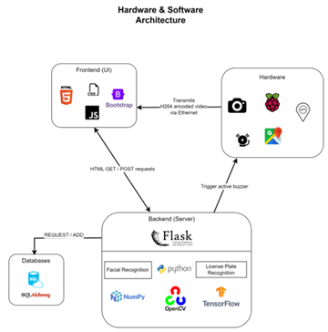
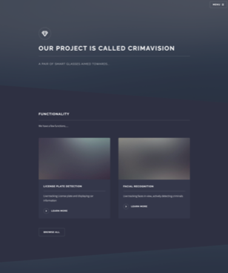
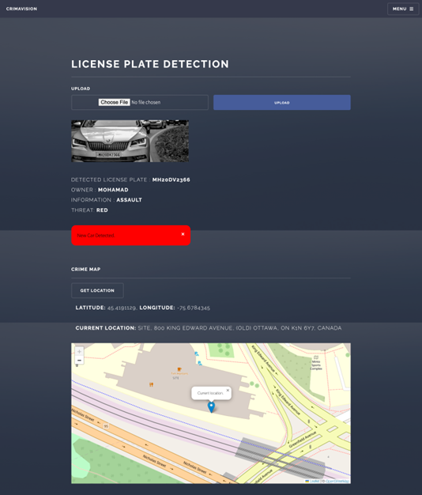
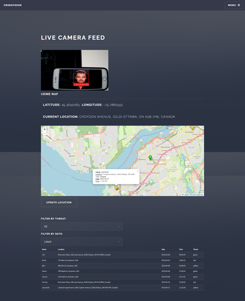

# CEG4912/4913 - SmartCam

### Contributors

Alexandre St-Martin - 300052137

Ahmad El Mokahal - 300059298

Ansh Patel - 300102472

Dima Cherepovskyi - 300016008

Humza Faisal – 300042664

Mohammad Osama – 8770948

### Dependencies

To install all the required dependencies: `pip install -r requirements.txt`
To run the flask application: `python3 app.py`

### System Architecture

    

### Screens

    

    

    

