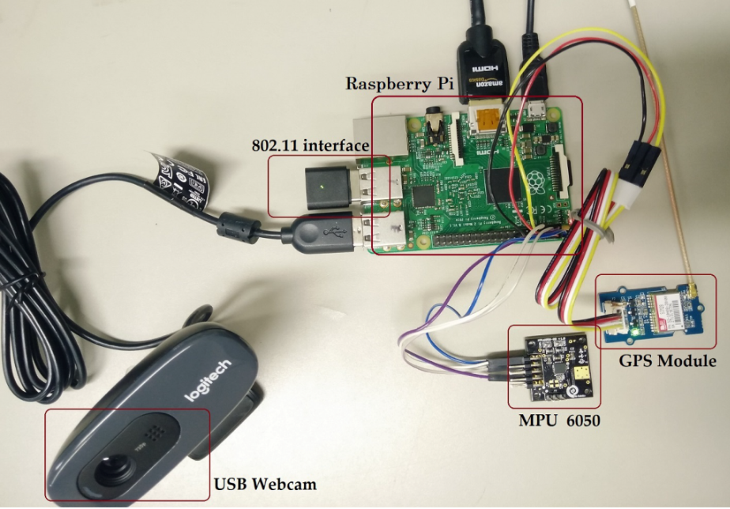

# CEG4912/4913 - SmartCam

### Description

SmartCam, a university capstone project, is an embedded system and smart camera geared towards enhancing law enforcement practices. It seamlessly integrates automatic facial detection and license plate recognition technologies to provide practical solutions for policing. The hardware is integrated with a user-friendly web application, offering real-time updates and notifications as well as a streamlined user interface.

Release document: https://1drv.ms/w/s!AsVyL8ltotB7rLxX65z8n5NrvH76mg?e=GNoRhJ

### Hardware

* Raspberry Pi 4 Model B (8GB RAM)
* RPi Camera V2 Module
* RPi USB-C 5.1V Power supply
* BN-220 GPS module
* 5V Active buzzer alarm module
* RJ-45 Ethernet cable
* Breadboard
* Solderless wires

### Software

* Frontend: HTML, CSS, Bootstrap library
* Backend: Python, Flask, OpenCV, Pytesseract
* Databases: SQLite

### App Dependencies

To install all the required dependencies: 

* `pip install -r requirements.txt`

To run the flask application:

* `python3 app.py`

### System Architecture

    

    

### Frontend UI Screens

    

    

    

